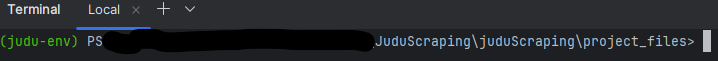
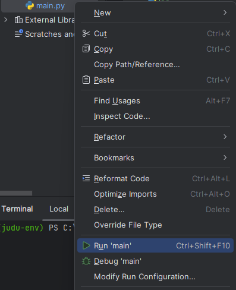
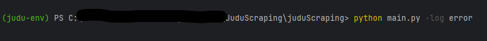

# Judu Scraping 

## Description of the project
This project will open [Judu](https://judu.lt/) web page. \
Select the "4G" bus and check the timetables of the "Europos aikštė" station. \
The timetable will be scrapped into the MongoDB database and exel file. \
After hours and minutes in the database, the script will check what buses will drive that hour, the previous hour, 
and the next hour. (You will find this information in the logs.log file) 
Hours that have the same minutes will be inserted into the JSON file. 
(All files will be found in the project_files folder)

## Installation

*Follow these steps to clone the repository:*

1. On GitHub.com, navigate to the main page of the repository.
2. Above the list of files, click <> Code
3. Copy the URL for the repository.
4. Open Git Bash.
5. Change the current working directory to the location where you want the cloned directory.
6. Type git clone, and then paste the URL you copied earlier.
##

*On your local machine, install requirement.txt to get all libraries (python needs to be installed):*

1. Open a terminal and navigate to the directory where you copied the project and go to project_files folder\
    
2. Type this command: 
```
pip install -r requirements.txt
```
##
___


## How To Run Script

You can run it through:
In console navigated to main directory
```
python main.py
```
Or\
In the main directory press the left mouse key -> Run 'main'




Log levels can be changed in console:
```commandline
python main.py -log error
```


Default log level: info(File could be found in project_files folder)

## Used libraries

The project was written in the Python programming language.
Libraries used: Selenium, Holidays, BeautifulSoup, Pandas, MongoClient.\

## Clear code
Pylint was used as a code analysis tool during this project.\
Run pylint write in the main directory console: 
```commandline
pylint *
```

## Feedback

If you have any feedback, please reach out.
